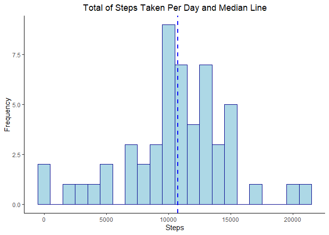
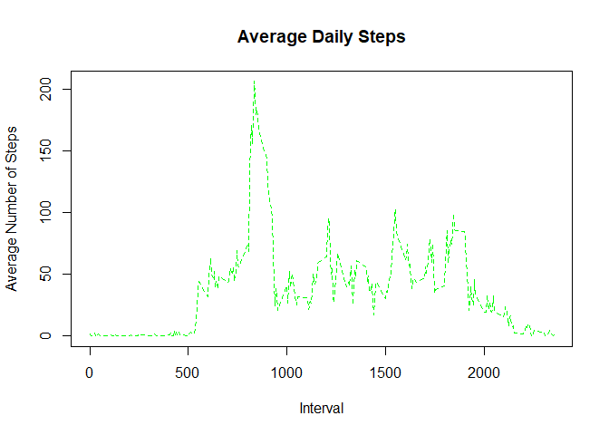
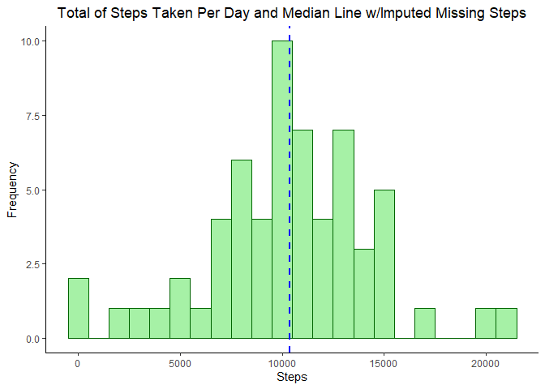
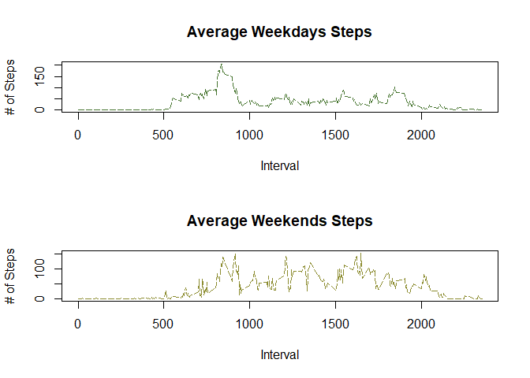

## Introduction

It is now possible to collect a large amount of data about personal movement using activity monitoring devices such as a Fitbit, Nike Fuelband, or Jawbone Up. These type of devices are part of the “quantified self” movement – a group of enthusiasts who take measurements about themselves regularly to improve their health, to find patterns in their behavior, or because they are tech geeks. But these data remain under-utilized both because the raw data are hard to obtain and there is a lack of statistical methods and software for processing and interpreting the data.

This assignment makes use of data from a personal activity monitoring device. This device collects data at 5 minute intervals through out the day. The data consists of two months of data from an anonymous individual collected during the months of October and November, 2012 and include the number of steps taken in 5 minute intervals each day.

## Loading and preprocessing the data

1.Load and/or install needed packages


```r
InstallLoadPackages <- function(needed_pkg){
  
  new_pkg <- needed_pkg[!(needed_pkg %in% installed.packages()[, "Package"])]
  
  if (length(new_pkg)) 
    install.packages(new_pkg, dependencies = TRUE)
  
  sapply(needed_pkg, require, character.only = TRUE)
}

needed_pkg <- c("dplyr","ggplot2","gt","mice")

InstallLoadPackages(needed_pkg)
```

```
##   dplyr ggplot2      gt    mice 
##    TRUE    TRUE    TRUE    TRUE
```

2. Read activities data


```r
Activities <- read.csv("activity.csv", header = TRUE, na.strings = "NA", sep = ",")
```

3. Check data through some preprocessing commands


```r
dim(Activities)
```

```
## [1] 17568     3
```

```r
head(Activities)
```

```
##   steps       date interval
## 1    NA 2012-10-01        0
## 2    NA 2012-10-01        5
## 3    NA 2012-10-01       10
## 4    NA 2012-10-01       15
## 5    NA 2012-10-01       20
## 6    NA 2012-10-01       25
```

```r
glimpse(Activities)
```

```
## Rows: 17,568
## Columns: 3
## $ steps    <int> NA, NA, NA, NA, NA, NA, NA, NA, NA, NA, NA, NA, NA, NA, NA...
## $ date     <chr> "2012-10-01", "2012-10-01", "2012-10-01", "2012-10-01", "2...
## $ interval <int> 0, 5, 10, 15, 20, 25, 30, 35, 40, 45, 50, 55, 100, 105, 11...
```

```r
summary(Activities)
```

```
##      steps            date              interval     
##  Min.   :  0.00   Length:17568       Min.   :   0.0  
##  1st Qu.:  0.00   Class :character   1st Qu.: 588.8  
##  Median :  0.00   Mode  :character   Median :1177.5  
##  Mean   : 37.38                      Mean   :1177.5  
##  3rd Qu.: 12.00                      3rd Qu.:1766.2  
##  Max.   :806.00                      Max.   :2355.0  
##  NA's   :2304
```

4. Assign date format to date field and assign factor format to interval 


```r
Activities$date <- as.Date(Activities$date, format = "%Y-%m-%d")
str(Activities)
```

```
## 'data.frame':	17568 obs. of  3 variables:
##  $ steps   : int  NA NA NA NA NA NA NA NA NA NA ...
##  $ date    : Date, format: "2012-10-01" "2012-10-01" ...
##  $ interval: int  0 5 10 15 20 25 30 35 40 45 ...
```

## What is mean total number of steps taken per day?

1. Aggregate steps by day


```r
StepsPerDay <- aggregate(steps ~ date, data = Activities, sum, na.rm = TRUE)
head(StepsPerDay)
```

```
##         date steps
## 1 2012-10-02   126
## 2 2012-10-03 11352
## 3 2012-10-04 12116
## 4 2012-10-05 13294
## 5 2012-10-06 15420
## 6 2012-10-07 11015
```

```r
tail(StepsPerDay)
```

```
##          date steps
## 48 2012-11-24 14478
## 49 2012-11-25 11834
## 50 2012-11-26 11162
## 51 2012-11-27 13646
## 52 2012-11-28 10183
## 53 2012-11-29  7047
```


2. Plot of total steps by day, mean and median line.


```r
ggplot(StepsPerDay, aes(x=steps)) +
  geom_histogram(binwidth = 1000, color='darkblue', fill='lightblue') +
  geom_vline(aes(xintercept=mean(steps)),
            color="red", linetype="dashed", size=1) + 
  geom_vline(aes(xintercept=median(steps)),
             color="blue", linetype="dashed", size=1) + 
  labs(title = "Total of Steps Taken Per Day and Median Line", x = "Steps", y = "Frequency")  + theme_classic()+ 
  theme(plot.title = element_text(hjust = 0.5))
```

<!-- -->

3. Calculate mean and median


```r
df <- data.frame("Mean" = mean(StepsPerDay$steps), "Median" = median(StepsPerDay$steps))
gt(df)
```

<!--html_preserve--><style>html {
  font-family: -apple-system, BlinkMacSystemFont, 'Segoe UI', Roboto, Oxygen, Ubuntu, Cantarell, 'Helvetica Neue', 'Fira Sans', 'Droid Sans', Arial, sans-serif;
}

#tyomvhqndc .gt_table {
  display: table;
  border-collapse: collapse;
  margin-left: auto;
  margin-right: auto;
  color: #333333;
  font-size: 16px;
  font-weight: normal;
  font-style: normal;
  background-color: #FFFFFF;
  width: auto;
  border-top-style: solid;
  border-top-width: 2px;
  border-top-color: #A8A8A8;
  border-right-style: none;
  border-right-width: 2px;
  border-right-color: #D3D3D3;
  border-bottom-style: solid;
  border-bottom-width: 2px;
  border-bottom-color: #A8A8A8;
  border-left-style: none;
  border-left-width: 2px;
  border-left-color: #D3D3D3;
}

#tyomvhqndc .gt_heading {
  background-color: #FFFFFF;
  text-align: center;
  border-bottom-color: #FFFFFF;
  border-left-style: none;
  border-left-width: 1px;
  border-left-color: #D3D3D3;
  border-right-style: none;
  border-right-width: 1px;
  border-right-color: #D3D3D3;
}

#tyomvhqndc .gt_title {
  color: #333333;
  font-size: 125%;
  font-weight: initial;
  padding-top: 4px;
  padding-bottom: 4px;
  border-bottom-color: #FFFFFF;
  border-bottom-width: 0;
}

#tyomvhqndc .gt_subtitle {
  color: #333333;
  font-size: 85%;
  font-weight: initial;
  padding-top: 0;
  padding-bottom: 4px;
  border-top-color: #FFFFFF;
  border-top-width: 0;
}

#tyomvhqndc .gt_bottom_border {
  border-bottom-style: solid;
  border-bottom-width: 2px;
  border-bottom-color: #D3D3D3;
}

#tyomvhqndc .gt_col_headings {
  border-top-style: solid;
  border-top-width: 2px;
  border-top-color: #D3D3D3;
  border-bottom-style: solid;
  border-bottom-width: 2px;
  border-bottom-color: #D3D3D3;
  border-left-style: none;
  border-left-width: 1px;
  border-left-color: #D3D3D3;
  border-right-style: none;
  border-right-width: 1px;
  border-right-color: #D3D3D3;
}

#tyomvhqndc .gt_col_heading {
  color: #333333;
  background-color: #FFFFFF;
  font-size: 100%;
  font-weight: normal;
  text-transform: inherit;
  border-left-style: none;
  border-left-width: 1px;
  border-left-color: #D3D3D3;
  border-right-style: none;
  border-right-width: 1px;
  border-right-color: #D3D3D3;
  vertical-align: bottom;
  padding-top: 5px;
  padding-bottom: 6px;
  padding-left: 5px;
  padding-right: 5px;
  overflow-x: hidden;
}

#tyomvhqndc .gt_column_spanner_outer {
  color: #333333;
  background-color: #FFFFFF;
  font-size: 100%;
  font-weight: normal;
  text-transform: inherit;
  padding-top: 0;
  padding-bottom: 0;
  padding-left: 4px;
  padding-right: 4px;
}

#tyomvhqndc .gt_column_spanner_outer:first-child {
  padding-left: 0;
}

#tyomvhqndc .gt_column_spanner_outer:last-child {
  padding-right: 0;
}

#tyomvhqndc .gt_column_spanner {
  border-bottom-style: solid;
  border-bottom-width: 2px;
  border-bottom-color: #D3D3D3;
  vertical-align: bottom;
  padding-top: 5px;
  padding-bottom: 6px;
  overflow-x: hidden;
  display: inline-block;
  width: 100%;
}

#tyomvhqndc .gt_group_heading {
  padding: 8px;
  color: #333333;
  background-color: #FFFFFF;
  font-size: 100%;
  font-weight: initial;
  text-transform: inherit;
  border-top-style: solid;
  border-top-width: 2px;
  border-top-color: #D3D3D3;
  border-bottom-style: solid;
  border-bottom-width: 2px;
  border-bottom-color: #D3D3D3;
  border-left-style: none;
  border-left-width: 1px;
  border-left-color: #D3D3D3;
  border-right-style: none;
  border-right-width: 1px;
  border-right-color: #D3D3D3;
  vertical-align: middle;
}

#tyomvhqndc .gt_empty_group_heading {
  padding: 0.5px;
  color: #333333;
  background-color: #FFFFFF;
  font-size: 100%;
  font-weight: initial;
  border-top-style: solid;
  border-top-width: 2px;
  border-top-color: #D3D3D3;
  border-bottom-style: solid;
  border-bottom-width: 2px;
  border-bottom-color: #D3D3D3;
  vertical-align: middle;
}

#tyomvhqndc .gt_from_md > :first-child {
  margin-top: 0;
}

#tyomvhqndc .gt_from_md > :last-child {
  margin-bottom: 0;
}

#tyomvhqndc .gt_row {
  padding-top: 8px;
  padding-bottom: 8px;
  padding-left: 5px;
  padding-right: 5px;
  margin: 10px;
  border-top-style: solid;
  border-top-width: 1px;
  border-top-color: #D3D3D3;
  border-left-style: none;
  border-left-width: 1px;
  border-left-color: #D3D3D3;
  border-right-style: none;
  border-right-width: 1px;
  border-right-color: #D3D3D3;
  vertical-align: middle;
  overflow-x: hidden;
}

#tyomvhqndc .gt_stub {
  color: #333333;
  background-color: #FFFFFF;
  font-size: 100%;
  font-weight: initial;
  text-transform: inherit;
  border-right-style: solid;
  border-right-width: 2px;
  border-right-color: #D3D3D3;
  padding-left: 12px;
}

#tyomvhqndc .gt_summary_row {
  color: #333333;
  background-color: #FFFFFF;
  text-transform: inherit;
  padding-top: 8px;
  padding-bottom: 8px;
  padding-left: 5px;
  padding-right: 5px;
}

#tyomvhqndc .gt_first_summary_row {
  padding-top: 8px;
  padding-bottom: 8px;
  padding-left: 5px;
  padding-right: 5px;
  border-top-style: solid;
  border-top-width: 2px;
  border-top-color: #D3D3D3;
}

#tyomvhqndc .gt_grand_summary_row {
  color: #333333;
  background-color: #FFFFFF;
  text-transform: inherit;
  padding-top: 8px;
  padding-bottom: 8px;
  padding-left: 5px;
  padding-right: 5px;
}

#tyomvhqndc .gt_first_grand_summary_row {
  padding-top: 8px;
  padding-bottom: 8px;
  padding-left: 5px;
  padding-right: 5px;
  border-top-style: double;
  border-top-width: 6px;
  border-top-color: #D3D3D3;
}

#tyomvhqndc .gt_striped {
  background-color: rgba(128, 128, 128, 0.05);
}

#tyomvhqndc .gt_table_body {
  border-top-style: solid;
  border-top-width: 2px;
  border-top-color: #D3D3D3;
  border-bottom-style: solid;
  border-bottom-width: 2px;
  border-bottom-color: #D3D3D3;
}

#tyomvhqndc .gt_footnotes {
  color: #333333;
  background-color: #FFFFFF;
  border-bottom-style: none;
  border-bottom-width: 2px;
  border-bottom-color: #D3D3D3;
  border-left-style: none;
  border-left-width: 2px;
  border-left-color: #D3D3D3;
  border-right-style: none;
  border-right-width: 2px;
  border-right-color: #D3D3D3;
}

#tyomvhqndc .gt_footnote {
  margin: 0px;
  font-size: 90%;
  padding: 4px;
}

#tyomvhqndc .gt_sourcenotes {
  color: #333333;
  background-color: #FFFFFF;
  border-bottom-style: none;
  border-bottom-width: 2px;
  border-bottom-color: #D3D3D3;
  border-left-style: none;
  border-left-width: 2px;
  border-left-color: #D3D3D3;
  border-right-style: none;
  border-right-width: 2px;
  border-right-color: #D3D3D3;
}

#tyomvhqndc .gt_sourcenote {
  font-size: 90%;
  padding: 4px;
}

#tyomvhqndc .gt_left {
  text-align: left;
}

#tyomvhqndc .gt_center {
  text-align: center;
}

#tyomvhqndc .gt_right {
  text-align: right;
  font-variant-numeric: tabular-nums;
}

#tyomvhqndc .gt_font_normal {
  font-weight: normal;
}

#tyomvhqndc .gt_font_bold {
  font-weight: bold;
}

#tyomvhqndc .gt_font_italic {
  font-style: italic;
}

#tyomvhqndc .gt_super {
  font-size: 65%;
}

#tyomvhqndc .gt_footnote_marks {
  font-style: italic;
  font-size: 65%;
}
</style>
<div id="tyomvhqndc" style="overflow-x:auto;overflow-y:auto;width:auto;height:auto;"><table class="gt_table">
  
  <thead class="gt_col_headings">
    <tr>
      <th class="gt_col_heading gt_columns_bottom_border gt_right" rowspan="1" colspan="1">Mean</th>
      <th class="gt_col_heading gt_columns_bottom_border gt_center" rowspan="1" colspan="1">Median</th>
    </tr>
  </thead>
  <tbody class="gt_table_body">
    <tr>
      <td class="gt_row gt_right">10766.19</td>
      <td class="gt_row gt_center">10765</td>
    </tr>
  </tbody>
  
  
</table></div><!--/html_preserve-->

## What is the average daily activity pattern?

1 - Calculate the average daily activity pattern


```r
StepsEachFiveMinutes <-  Activities %>% 
                                    group_by(interval) %>% 
                                    summarize(mean = mean(steps, na.rm = TRUE))
```

```
## `summarise()` ungrouping output (override with `.groups` argument)
```

```r
StepsEachFiveMinutes$interval <- as.factor(StepsEachFiveMinutes$interval)
str(StepsEachFiveMinutes)
```

```
## tibble [288 x 2] (S3: tbl_df/tbl/data.frame)
##  $ interval: Factor w/ 288 levels "0","5","10","15",..: 1 2 3 4 5 6 7 8 9 10 ...
##  $ mean    : num [1:288] 1.717 0.3396 0.1321 0.1509 0.0755 ...
```

2. Time series plot of the 5-minute interval and the average number of steps taken 


```r
plot(as.integer(levels(StepsEachFiveMinutes$interval)), StepsEachFiveMinutes$mean,
     type="l", lty = 2, lwd = 1.5,
     xlab = "Interval", ylab = "Average Number of Steps", main = "Average Daily Steps",      col ="green")
```

<!-- -->


3. Find and format Max Steps Number and Interval


```r
df <- data.frame("Max Steps" = max(StepsEachFiveMinutes$mean), 
                 "Interval" = subset(StepsEachFiveMinutes, mean ==     max(StepsEachFiveMinutes$mean))$interval)
gt(df)
```

<!--html_preserve--><style>html {
  font-family: -apple-system, BlinkMacSystemFont, 'Segoe UI', Roboto, Oxygen, Ubuntu, Cantarell, 'Helvetica Neue', 'Fira Sans', 'Droid Sans', Arial, sans-serif;
}

#rpiaanrkkt .gt_table {
  display: table;
  border-collapse: collapse;
  margin-left: auto;
  margin-right: auto;
  color: #333333;
  font-size: 16px;
  font-weight: normal;
  font-style: normal;
  background-color: #FFFFFF;
  width: auto;
  border-top-style: solid;
  border-top-width: 2px;
  border-top-color: #A8A8A8;
  border-right-style: none;
  border-right-width: 2px;
  border-right-color: #D3D3D3;
  border-bottom-style: solid;
  border-bottom-width: 2px;
  border-bottom-color: #A8A8A8;
  border-left-style: none;
  border-left-width: 2px;
  border-left-color: #D3D3D3;
}

#rpiaanrkkt .gt_heading {
  background-color: #FFFFFF;
  text-align: center;
  border-bottom-color: #FFFFFF;
  border-left-style: none;
  border-left-width: 1px;
  border-left-color: #D3D3D3;
  border-right-style: none;
  border-right-width: 1px;
  border-right-color: #D3D3D3;
}

#rpiaanrkkt .gt_title {
  color: #333333;
  font-size: 125%;
  font-weight: initial;
  padding-top: 4px;
  padding-bottom: 4px;
  border-bottom-color: #FFFFFF;
  border-bottom-width: 0;
}

#rpiaanrkkt .gt_subtitle {
  color: #333333;
  font-size: 85%;
  font-weight: initial;
  padding-top: 0;
  padding-bottom: 4px;
  border-top-color: #FFFFFF;
  border-top-width: 0;
}

#rpiaanrkkt .gt_bottom_border {
  border-bottom-style: solid;
  border-bottom-width: 2px;
  border-bottom-color: #D3D3D3;
}

#rpiaanrkkt .gt_col_headings {
  border-top-style: solid;
  border-top-width: 2px;
  border-top-color: #D3D3D3;
  border-bottom-style: solid;
  border-bottom-width: 2px;
  border-bottom-color: #D3D3D3;
  border-left-style: none;
  border-left-width: 1px;
  border-left-color: #D3D3D3;
  border-right-style: none;
  border-right-width: 1px;
  border-right-color: #D3D3D3;
}

#rpiaanrkkt .gt_col_heading {
  color: #333333;
  background-color: #FFFFFF;
  font-size: 100%;
  font-weight: normal;
  text-transform: inherit;
  border-left-style: none;
  border-left-width: 1px;
  border-left-color: #D3D3D3;
  border-right-style: none;
  border-right-width: 1px;
  border-right-color: #D3D3D3;
  vertical-align: bottom;
  padding-top: 5px;
  padding-bottom: 6px;
  padding-left: 5px;
  padding-right: 5px;
  overflow-x: hidden;
}

#rpiaanrkkt .gt_column_spanner_outer {
  color: #333333;
  background-color: #FFFFFF;
  font-size: 100%;
  font-weight: normal;
  text-transform: inherit;
  padding-top: 0;
  padding-bottom: 0;
  padding-left: 4px;
  padding-right: 4px;
}

#rpiaanrkkt .gt_column_spanner_outer:first-child {
  padding-left: 0;
}

#rpiaanrkkt .gt_column_spanner_outer:last-child {
  padding-right: 0;
}

#rpiaanrkkt .gt_column_spanner {
  border-bottom-style: solid;
  border-bottom-width: 2px;
  border-bottom-color: #D3D3D3;
  vertical-align: bottom;
  padding-top: 5px;
  padding-bottom: 6px;
  overflow-x: hidden;
  display: inline-block;
  width: 100%;
}

#rpiaanrkkt .gt_group_heading {
  padding: 8px;
  color: #333333;
  background-color: #FFFFFF;
  font-size: 100%;
  font-weight: initial;
  text-transform: inherit;
  border-top-style: solid;
  border-top-width: 2px;
  border-top-color: #D3D3D3;
  border-bottom-style: solid;
  border-bottom-width: 2px;
  border-bottom-color: #D3D3D3;
  border-left-style: none;
  border-left-width: 1px;
  border-left-color: #D3D3D3;
  border-right-style: none;
  border-right-width: 1px;
  border-right-color: #D3D3D3;
  vertical-align: middle;
}

#rpiaanrkkt .gt_empty_group_heading {
  padding: 0.5px;
  color: #333333;
  background-color: #FFFFFF;
  font-size: 100%;
  font-weight: initial;
  border-top-style: solid;
  border-top-width: 2px;
  border-top-color: #D3D3D3;
  border-bottom-style: solid;
  border-bottom-width: 2px;
  border-bottom-color: #D3D3D3;
  vertical-align: middle;
}

#rpiaanrkkt .gt_from_md > :first-child {
  margin-top: 0;
}

#rpiaanrkkt .gt_from_md > :last-child {
  margin-bottom: 0;
}

#rpiaanrkkt .gt_row {
  padding-top: 8px;
  padding-bottom: 8px;
  padding-left: 5px;
  padding-right: 5px;
  margin: 10px;
  border-top-style: solid;
  border-top-width: 1px;
  border-top-color: #D3D3D3;
  border-left-style: none;
  border-left-width: 1px;
  border-left-color: #D3D3D3;
  border-right-style: none;
  border-right-width: 1px;
  border-right-color: #D3D3D3;
  vertical-align: middle;
  overflow-x: hidden;
}

#rpiaanrkkt .gt_stub {
  color: #333333;
  background-color: #FFFFFF;
  font-size: 100%;
  font-weight: initial;
  text-transform: inherit;
  border-right-style: solid;
  border-right-width: 2px;
  border-right-color: #D3D3D3;
  padding-left: 12px;
}

#rpiaanrkkt .gt_summary_row {
  color: #333333;
  background-color: #FFFFFF;
  text-transform: inherit;
  padding-top: 8px;
  padding-bottom: 8px;
  padding-left: 5px;
  padding-right: 5px;
}

#rpiaanrkkt .gt_first_summary_row {
  padding-top: 8px;
  padding-bottom: 8px;
  padding-left: 5px;
  padding-right: 5px;
  border-top-style: solid;
  border-top-width: 2px;
  border-top-color: #D3D3D3;
}

#rpiaanrkkt .gt_grand_summary_row {
  color: #333333;
  background-color: #FFFFFF;
  text-transform: inherit;
  padding-top: 8px;
  padding-bottom: 8px;
  padding-left: 5px;
  padding-right: 5px;
}

#rpiaanrkkt .gt_first_grand_summary_row {
  padding-top: 8px;
  padding-bottom: 8px;
  padding-left: 5px;
  padding-right: 5px;
  border-top-style: double;
  border-top-width: 6px;
  border-top-color: #D3D3D3;
}

#rpiaanrkkt .gt_striped {
  background-color: rgba(128, 128, 128, 0.05);
}

#rpiaanrkkt .gt_table_body {
  border-top-style: solid;
  border-top-width: 2px;
  border-top-color: #D3D3D3;
  border-bottom-style: solid;
  border-bottom-width: 2px;
  border-bottom-color: #D3D3D3;
}

#rpiaanrkkt .gt_footnotes {
  color: #333333;
  background-color: #FFFFFF;
  border-bottom-style: none;
  border-bottom-width: 2px;
  border-bottom-color: #D3D3D3;
  border-left-style: none;
  border-left-width: 2px;
  border-left-color: #D3D3D3;
  border-right-style: none;
  border-right-width: 2px;
  border-right-color: #D3D3D3;
}

#rpiaanrkkt .gt_footnote {
  margin: 0px;
  font-size: 90%;
  padding: 4px;
}

#rpiaanrkkt .gt_sourcenotes {
  color: #333333;
  background-color: #FFFFFF;
  border-bottom-style: none;
  border-bottom-width: 2px;
  border-bottom-color: #D3D3D3;
  border-left-style: none;
  border-left-width: 2px;
  border-left-color: #D3D3D3;
  border-right-style: none;
  border-right-width: 2px;
  border-right-color: #D3D3D3;
}

#rpiaanrkkt .gt_sourcenote {
  font-size: 90%;
  padding: 4px;
}

#rpiaanrkkt .gt_left {
  text-align: left;
}

#rpiaanrkkt .gt_center {
  text-align: center;
}

#rpiaanrkkt .gt_right {
  text-align: right;
  font-variant-numeric: tabular-nums;
}

#rpiaanrkkt .gt_font_normal {
  font-weight: normal;
}

#rpiaanrkkt .gt_font_bold {
  font-weight: bold;
}

#rpiaanrkkt .gt_font_italic {
  font-style: italic;
}

#rpiaanrkkt .gt_super {
  font-size: 65%;
}

#rpiaanrkkt .gt_footnote_marks {
  font-style: italic;
  font-size: 65%;
}
</style>
<div id="rpiaanrkkt" style="overflow-x:auto;overflow-y:auto;width:auto;height:auto;"><table class="gt_table">
  
  <thead class="gt_col_headings">
    <tr>
      <th class="gt_col_heading gt_columns_bottom_border gt_right" rowspan="1" colspan="1">Max.Steps</th>
      <th class="gt_col_heading gt_columns_bottom_border gt_center" rowspan="1" colspan="1">Interval</th>
    </tr>
  </thead>
  <tbody class="gt_table_body">
    <tr>
      <td class="gt_row gt_right">206.1698</td>
      <td class="gt_row gt_center">835</td>
    </tr>
  </tbody>
  
  
</table></div><!--/html_preserve-->

## Imputing missing values


1. Total rows with missing values


```r
df <- data.frame("Missing Steps" = sum(is.na(as.character(Activities$steps))),
                 "Missing Dates" = sum(is.na(as.character(Activities$date))),
                 "Missing Intervals" = sum(is.na(as.character(Activities$interval))))
gt(df)
```

<!--html_preserve--><style>html {
  font-family: -apple-system, BlinkMacSystemFont, 'Segoe UI', Roboto, Oxygen, Ubuntu, Cantarell, 'Helvetica Neue', 'Fira Sans', 'Droid Sans', Arial, sans-serif;
}

#dkzlwpwpjq .gt_table {
  display: table;
  border-collapse: collapse;
  margin-left: auto;
  margin-right: auto;
  color: #333333;
  font-size: 16px;
  font-weight: normal;
  font-style: normal;
  background-color: #FFFFFF;
  width: auto;
  border-top-style: solid;
  border-top-width: 2px;
  border-top-color: #A8A8A8;
  border-right-style: none;
  border-right-width: 2px;
  border-right-color: #D3D3D3;
  border-bottom-style: solid;
  border-bottom-width: 2px;
  border-bottom-color: #A8A8A8;
  border-left-style: none;
  border-left-width: 2px;
  border-left-color: #D3D3D3;
}

#dkzlwpwpjq .gt_heading {
  background-color: #FFFFFF;
  text-align: center;
  border-bottom-color: #FFFFFF;
  border-left-style: none;
  border-left-width: 1px;
  border-left-color: #D3D3D3;
  border-right-style: none;
  border-right-width: 1px;
  border-right-color: #D3D3D3;
}

#dkzlwpwpjq .gt_title {
  color: #333333;
  font-size: 125%;
  font-weight: initial;
  padding-top: 4px;
  padding-bottom: 4px;
  border-bottom-color: #FFFFFF;
  border-bottom-width: 0;
}

#dkzlwpwpjq .gt_subtitle {
  color: #333333;
  font-size: 85%;
  font-weight: initial;
  padding-top: 0;
  padding-bottom: 4px;
  border-top-color: #FFFFFF;
  border-top-width: 0;
}

#dkzlwpwpjq .gt_bottom_border {
  border-bottom-style: solid;
  border-bottom-width: 2px;
  border-bottom-color: #D3D3D3;
}

#dkzlwpwpjq .gt_col_headings {
  border-top-style: solid;
  border-top-width: 2px;
  border-top-color: #D3D3D3;
  border-bottom-style: solid;
  border-bottom-width: 2px;
  border-bottom-color: #D3D3D3;
  border-left-style: none;
  border-left-width: 1px;
  border-left-color: #D3D3D3;
  border-right-style: none;
  border-right-width: 1px;
  border-right-color: #D3D3D3;
}

#dkzlwpwpjq .gt_col_heading {
  color: #333333;
  background-color: #FFFFFF;
  font-size: 100%;
  font-weight: normal;
  text-transform: inherit;
  border-left-style: none;
  border-left-width: 1px;
  border-left-color: #D3D3D3;
  border-right-style: none;
  border-right-width: 1px;
  border-right-color: #D3D3D3;
  vertical-align: bottom;
  padding-top: 5px;
  padding-bottom: 6px;
  padding-left: 5px;
  padding-right: 5px;
  overflow-x: hidden;
}

#dkzlwpwpjq .gt_column_spanner_outer {
  color: #333333;
  background-color: #FFFFFF;
  font-size: 100%;
  font-weight: normal;
  text-transform: inherit;
  padding-top: 0;
  padding-bottom: 0;
  padding-left: 4px;
  padding-right: 4px;
}

#dkzlwpwpjq .gt_column_spanner_outer:first-child {
  padding-left: 0;
}

#dkzlwpwpjq .gt_column_spanner_outer:last-child {
  padding-right: 0;
}

#dkzlwpwpjq .gt_column_spanner {
  border-bottom-style: solid;
  border-bottom-width: 2px;
  border-bottom-color: #D3D3D3;
  vertical-align: bottom;
  padding-top: 5px;
  padding-bottom: 6px;
  overflow-x: hidden;
  display: inline-block;
  width: 100%;
}

#dkzlwpwpjq .gt_group_heading {
  padding: 8px;
  color: #333333;
  background-color: #FFFFFF;
  font-size: 100%;
  font-weight: initial;
  text-transform: inherit;
  border-top-style: solid;
  border-top-width: 2px;
  border-top-color: #D3D3D3;
  border-bottom-style: solid;
  border-bottom-width: 2px;
  border-bottom-color: #D3D3D3;
  border-left-style: none;
  border-left-width: 1px;
  border-left-color: #D3D3D3;
  border-right-style: none;
  border-right-width: 1px;
  border-right-color: #D3D3D3;
  vertical-align: middle;
}

#dkzlwpwpjq .gt_empty_group_heading {
  padding: 0.5px;
  color: #333333;
  background-color: #FFFFFF;
  font-size: 100%;
  font-weight: initial;
  border-top-style: solid;
  border-top-width: 2px;
  border-top-color: #D3D3D3;
  border-bottom-style: solid;
  border-bottom-width: 2px;
  border-bottom-color: #D3D3D3;
  vertical-align: middle;
}

#dkzlwpwpjq .gt_from_md > :first-child {
  margin-top: 0;
}

#dkzlwpwpjq .gt_from_md > :last-child {
  margin-bottom: 0;
}

#dkzlwpwpjq .gt_row {
  padding-top: 8px;
  padding-bottom: 8px;
  padding-left: 5px;
  padding-right: 5px;
  margin: 10px;
  border-top-style: solid;
  border-top-width: 1px;
  border-top-color: #D3D3D3;
  border-left-style: none;
  border-left-width: 1px;
  border-left-color: #D3D3D3;
  border-right-style: none;
  border-right-width: 1px;
  border-right-color: #D3D3D3;
  vertical-align: middle;
  overflow-x: hidden;
}

#dkzlwpwpjq .gt_stub {
  color: #333333;
  background-color: #FFFFFF;
  font-size: 100%;
  font-weight: initial;
  text-transform: inherit;
  border-right-style: solid;
  border-right-width: 2px;
  border-right-color: #D3D3D3;
  padding-left: 12px;
}

#dkzlwpwpjq .gt_summary_row {
  color: #333333;
  background-color: #FFFFFF;
  text-transform: inherit;
  padding-top: 8px;
  padding-bottom: 8px;
  padding-left: 5px;
  padding-right: 5px;
}

#dkzlwpwpjq .gt_first_summary_row {
  padding-top: 8px;
  padding-bottom: 8px;
  padding-left: 5px;
  padding-right: 5px;
  border-top-style: solid;
  border-top-width: 2px;
  border-top-color: #D3D3D3;
}

#dkzlwpwpjq .gt_grand_summary_row {
  color: #333333;
  background-color: #FFFFFF;
  text-transform: inherit;
  padding-top: 8px;
  padding-bottom: 8px;
  padding-left: 5px;
  padding-right: 5px;
}

#dkzlwpwpjq .gt_first_grand_summary_row {
  padding-top: 8px;
  padding-bottom: 8px;
  padding-left: 5px;
  padding-right: 5px;
  border-top-style: double;
  border-top-width: 6px;
  border-top-color: #D3D3D3;
}

#dkzlwpwpjq .gt_striped {
  background-color: rgba(128, 128, 128, 0.05);
}

#dkzlwpwpjq .gt_table_body {
  border-top-style: solid;
  border-top-width: 2px;
  border-top-color: #D3D3D3;
  border-bottom-style: solid;
  border-bottom-width: 2px;
  border-bottom-color: #D3D3D3;
}

#dkzlwpwpjq .gt_footnotes {
  color: #333333;
  background-color: #FFFFFF;
  border-bottom-style: none;
  border-bottom-width: 2px;
  border-bottom-color: #D3D3D3;
  border-left-style: none;
  border-left-width: 2px;
  border-left-color: #D3D3D3;
  border-right-style: none;
  border-right-width: 2px;
  border-right-color: #D3D3D3;
}

#dkzlwpwpjq .gt_footnote {
  margin: 0px;
  font-size: 90%;
  padding: 4px;
}

#dkzlwpwpjq .gt_sourcenotes {
  color: #333333;
  background-color: #FFFFFF;
  border-bottom-style: none;
  border-bottom-width: 2px;
  border-bottom-color: #D3D3D3;
  border-left-style: none;
  border-left-width: 2px;
  border-left-color: #D3D3D3;
  border-right-style: none;
  border-right-width: 2px;
  border-right-color: #D3D3D3;
}

#dkzlwpwpjq .gt_sourcenote {
  font-size: 90%;
  padding: 4px;
}

#dkzlwpwpjq .gt_left {
  text-align: left;
}

#dkzlwpwpjq .gt_center {
  text-align: center;
}

#dkzlwpwpjq .gt_right {
  text-align: right;
  font-variant-numeric: tabular-nums;
}

#dkzlwpwpjq .gt_font_normal {
  font-weight: normal;
}

#dkzlwpwpjq .gt_font_bold {
  font-weight: bold;
}

#dkzlwpwpjq .gt_font_italic {
  font-style: italic;
}

#dkzlwpwpjq .gt_super {
  font-size: 65%;
}

#dkzlwpwpjq .gt_footnote_marks {
  font-style: italic;
  font-size: 65%;
}
</style>
<div id="dkzlwpwpjq" style="overflow-x:auto;overflow-y:auto;width:auto;height:auto;"><table class="gt_table">
  
  <thead class="gt_col_headings">
    <tr>
      <th class="gt_col_heading gt_columns_bottom_border gt_center" rowspan="1" colspan="1">Missing.Steps</th>
      <th class="gt_col_heading gt_columns_bottom_border gt_center" rowspan="1" colspan="1">Missing.Dates</th>
      <th class="gt_col_heading gt_columns_bottom_border gt_center" rowspan="1" colspan="1">Missing.Intervals</th>
    </tr>
  </thead>
  <tbody class="gt_table_body">
    <tr>
      <td class="gt_row gt_center">2304</td>
      <td class="gt_row gt_center">0</td>
      <td class="gt_row gt_center">0</td>
    </tr>
  </tbody>
  
  
</table></div><!--/html_preserve-->


2. Create a new dataset with the missing data filled in using Predictive Mean Matching (PMM), which is a widely used statistical imputation method for missing values. It aims to reduce the bias introduced in a dataset through imputation, by drawing real values sampled from the data, by building a small subset of observations where the outcome variable matches the outcome of the observations with missing values.


```r
ActivitiesPMM <- mice(Activities,method='pmm',seed=38945,print=FALSE)
ActivitiesStepsImputed <- complete(ActivitiesPMM,2)
anyNA(ActivitiesStepsImputed)
```

```
## [1] FALSE
```

```r
glimpse(ActivitiesStepsImputed)
```

```
## Rows: 17,568
## Columns: 3
## $ steps    <int> 0, 0, 47, 47, 0, 0, 0, 0, 0, 0, 0, 0, 0, 0, 0, 0, 0, 0, 0,...
## $ date     <date> 2012-10-01, 2012-10-01, 2012-10-01, 2012-10-01, 2012-10-0...
## $ interval <int> 0, 5, 10, 15, 20, 25, 30, 35, 40, 45, 50, 55, 100, 105, 11...
```

3. Calculate total steps on the new dataset with imputed values. 


```r
StepsPerDayImputedSteps <- aggregate(steps ~ date, data = ActivitiesStepsImputed, sum)
head(StepsPerDayImputedSteps)
```

```
##         date steps
## 1 2012-10-01  8475
## 2 2012-10-02   126
## 3 2012-10-03 11352
## 4 2012-10-04 12116
## 5 2012-10-05 13294
## 6 2012-10-06 15420
```

```r
tail(StepsPerDayImputedSteps)
```

```
##          date steps
## 56 2012-11-25 11834
## 57 2012-11-26 11162
## 58 2012-11-27 13646
## 59 2012-11-28 10183
## 60 2012-11-29  7047
## 61 2012-11-30  9716
```


4. Histogram of the new dataset


```r
ggplot(StepsPerDayImputedSteps, aes(x=steps)) +
  geom_histogram(binwidth = 1000, color='darkgreen', fill='lightgreen',alpha=0.8) +
  geom_vline(aes(xintercept=mean(steps)),
            color="red", linetype="dashed", size=1) + 
  geom_vline(aes(xintercept=median(steps)),
             color="blue", linetype="dashed", size=1) + 
  labs(title = "Total of Steps Taken Per Day and Median Line w/Imputed Missing Steps", x = "Steps", y = "Frequency")  + 
  theme_classic() +
  theme(plot.title = element_text(hjust = 0.5))
```

<!-- -->


5. Comparing old and new mean and median, where the most obvious change was a reduction in steps median


```r
df <- data.frame("Previous Total Steps" = sum(StepsPerDay$steps), "New Total Steps" = sum(StepsPerDayImputedSteps$steps),"Previous Mean" = mean(StepsPerDay$steps), "New Mean" = mean(StepsPerDayImputedSteps$steps), "Previous Median" = median(StepsPerDay$steps),"New Median" = median(StepsPerDayImputedSteps$steps))

gt(df)
```

<!--html_preserve--><style>html {
  font-family: -apple-system, BlinkMacSystemFont, 'Segoe UI', Roboto, Oxygen, Ubuntu, Cantarell, 'Helvetica Neue', 'Fira Sans', 'Droid Sans', Arial, sans-serif;
}

#ncvhwqvwgs .gt_table {
  display: table;
  border-collapse: collapse;
  margin-left: auto;
  margin-right: auto;
  color: #333333;
  font-size: 16px;
  font-weight: normal;
  font-style: normal;
  background-color: #FFFFFF;
  width: auto;
  border-top-style: solid;
  border-top-width: 2px;
  border-top-color: #A8A8A8;
  border-right-style: none;
  border-right-width: 2px;
  border-right-color: #D3D3D3;
  border-bottom-style: solid;
  border-bottom-width: 2px;
  border-bottom-color: #A8A8A8;
  border-left-style: none;
  border-left-width: 2px;
  border-left-color: #D3D3D3;
}

#ncvhwqvwgs .gt_heading {
  background-color: #FFFFFF;
  text-align: center;
  border-bottom-color: #FFFFFF;
  border-left-style: none;
  border-left-width: 1px;
  border-left-color: #D3D3D3;
  border-right-style: none;
  border-right-width: 1px;
  border-right-color: #D3D3D3;
}

#ncvhwqvwgs .gt_title {
  color: #333333;
  font-size: 125%;
  font-weight: initial;
  padding-top: 4px;
  padding-bottom: 4px;
  border-bottom-color: #FFFFFF;
  border-bottom-width: 0;
}

#ncvhwqvwgs .gt_subtitle {
  color: #333333;
  font-size: 85%;
  font-weight: initial;
  padding-top: 0;
  padding-bottom: 4px;
  border-top-color: #FFFFFF;
  border-top-width: 0;
}

#ncvhwqvwgs .gt_bottom_border {
  border-bottom-style: solid;
  border-bottom-width: 2px;
  border-bottom-color: #D3D3D3;
}

#ncvhwqvwgs .gt_col_headings {
  border-top-style: solid;
  border-top-width: 2px;
  border-top-color: #D3D3D3;
  border-bottom-style: solid;
  border-bottom-width: 2px;
  border-bottom-color: #D3D3D3;
  border-left-style: none;
  border-left-width: 1px;
  border-left-color: #D3D3D3;
  border-right-style: none;
  border-right-width: 1px;
  border-right-color: #D3D3D3;
}

#ncvhwqvwgs .gt_col_heading {
  color: #333333;
  background-color: #FFFFFF;
  font-size: 100%;
  font-weight: normal;
  text-transform: inherit;
  border-left-style: none;
  border-left-width: 1px;
  border-left-color: #D3D3D3;
  border-right-style: none;
  border-right-width: 1px;
  border-right-color: #D3D3D3;
  vertical-align: bottom;
  padding-top: 5px;
  padding-bottom: 6px;
  padding-left: 5px;
  padding-right: 5px;
  overflow-x: hidden;
}

#ncvhwqvwgs .gt_column_spanner_outer {
  color: #333333;
  background-color: #FFFFFF;
  font-size: 100%;
  font-weight: normal;
  text-transform: inherit;
  padding-top: 0;
  padding-bottom: 0;
  padding-left: 4px;
  padding-right: 4px;
}

#ncvhwqvwgs .gt_column_spanner_outer:first-child {
  padding-left: 0;
}

#ncvhwqvwgs .gt_column_spanner_outer:last-child {
  padding-right: 0;
}

#ncvhwqvwgs .gt_column_spanner {
  border-bottom-style: solid;
  border-bottom-width: 2px;
  border-bottom-color: #D3D3D3;
  vertical-align: bottom;
  padding-top: 5px;
  padding-bottom: 6px;
  overflow-x: hidden;
  display: inline-block;
  width: 100%;
}

#ncvhwqvwgs .gt_group_heading {
  padding: 8px;
  color: #333333;
  background-color: #FFFFFF;
  font-size: 100%;
  font-weight: initial;
  text-transform: inherit;
  border-top-style: solid;
  border-top-width: 2px;
  border-top-color: #D3D3D3;
  border-bottom-style: solid;
  border-bottom-width: 2px;
  border-bottom-color: #D3D3D3;
  border-left-style: none;
  border-left-width: 1px;
  border-left-color: #D3D3D3;
  border-right-style: none;
  border-right-width: 1px;
  border-right-color: #D3D3D3;
  vertical-align: middle;
}

#ncvhwqvwgs .gt_empty_group_heading {
  padding: 0.5px;
  color: #333333;
  background-color: #FFFFFF;
  font-size: 100%;
  font-weight: initial;
  border-top-style: solid;
  border-top-width: 2px;
  border-top-color: #D3D3D3;
  border-bottom-style: solid;
  border-bottom-width: 2px;
  border-bottom-color: #D3D3D3;
  vertical-align: middle;
}

#ncvhwqvwgs .gt_from_md > :first-child {
  margin-top: 0;
}

#ncvhwqvwgs .gt_from_md > :last-child {
  margin-bottom: 0;
}

#ncvhwqvwgs .gt_row {
  padding-top: 8px;
  padding-bottom: 8px;
  padding-left: 5px;
  padding-right: 5px;
  margin: 10px;
  border-top-style: solid;
  border-top-width: 1px;
  border-top-color: #D3D3D3;
  border-left-style: none;
  border-left-width: 1px;
  border-left-color: #D3D3D3;
  border-right-style: none;
  border-right-width: 1px;
  border-right-color: #D3D3D3;
  vertical-align: middle;
  overflow-x: hidden;
}

#ncvhwqvwgs .gt_stub {
  color: #333333;
  background-color: #FFFFFF;
  font-size: 100%;
  font-weight: initial;
  text-transform: inherit;
  border-right-style: solid;
  border-right-width: 2px;
  border-right-color: #D3D3D3;
  padding-left: 12px;
}

#ncvhwqvwgs .gt_summary_row {
  color: #333333;
  background-color: #FFFFFF;
  text-transform: inherit;
  padding-top: 8px;
  padding-bottom: 8px;
  padding-left: 5px;
  padding-right: 5px;
}

#ncvhwqvwgs .gt_first_summary_row {
  padding-top: 8px;
  padding-bottom: 8px;
  padding-left: 5px;
  padding-right: 5px;
  border-top-style: solid;
  border-top-width: 2px;
  border-top-color: #D3D3D3;
}

#ncvhwqvwgs .gt_grand_summary_row {
  color: #333333;
  background-color: #FFFFFF;
  text-transform: inherit;
  padding-top: 8px;
  padding-bottom: 8px;
  padding-left: 5px;
  padding-right: 5px;
}

#ncvhwqvwgs .gt_first_grand_summary_row {
  padding-top: 8px;
  padding-bottom: 8px;
  padding-left: 5px;
  padding-right: 5px;
  border-top-style: double;
  border-top-width: 6px;
  border-top-color: #D3D3D3;
}

#ncvhwqvwgs .gt_striped {
  background-color: rgba(128, 128, 128, 0.05);
}

#ncvhwqvwgs .gt_table_body {
  border-top-style: solid;
  border-top-width: 2px;
  border-top-color: #D3D3D3;
  border-bottom-style: solid;
  border-bottom-width: 2px;
  border-bottom-color: #D3D3D3;
}

#ncvhwqvwgs .gt_footnotes {
  color: #333333;
  background-color: #FFFFFF;
  border-bottom-style: none;
  border-bottom-width: 2px;
  border-bottom-color: #D3D3D3;
  border-left-style: none;
  border-left-width: 2px;
  border-left-color: #D3D3D3;
  border-right-style: none;
  border-right-width: 2px;
  border-right-color: #D3D3D3;
}

#ncvhwqvwgs .gt_footnote {
  margin: 0px;
  font-size: 90%;
  padding: 4px;
}

#ncvhwqvwgs .gt_sourcenotes {
  color: #333333;
  background-color: #FFFFFF;
  border-bottom-style: none;
  border-bottom-width: 2px;
  border-bottom-color: #D3D3D3;
  border-left-style: none;
  border-left-width: 2px;
  border-left-color: #D3D3D3;
  border-right-style: none;
  border-right-width: 2px;
  border-right-color: #D3D3D3;
}

#ncvhwqvwgs .gt_sourcenote {
  font-size: 90%;
  padding: 4px;
}

#ncvhwqvwgs .gt_left {
  text-align: left;
}

#ncvhwqvwgs .gt_center {
  text-align: center;
}

#ncvhwqvwgs .gt_right {
  text-align: right;
  font-variant-numeric: tabular-nums;
}

#ncvhwqvwgs .gt_font_normal {
  font-weight: normal;
}

#ncvhwqvwgs .gt_font_bold {
  font-weight: bold;
}

#ncvhwqvwgs .gt_font_italic {
  font-style: italic;
}

#ncvhwqvwgs .gt_super {
  font-size: 65%;
}

#ncvhwqvwgs .gt_footnote_marks {
  font-style: italic;
  font-size: 65%;
}
</style>
<div id="ncvhwqvwgs" style="overflow-x:auto;overflow-y:auto;width:auto;height:auto;"><table class="gt_table">
  
  <thead class="gt_col_headings">
    <tr>
      <th class="gt_col_heading gt_columns_bottom_border gt_center" rowspan="1" colspan="1">Previous.Total.Steps</th>
      <th class="gt_col_heading gt_columns_bottom_border gt_center" rowspan="1" colspan="1">New.Total.Steps</th>
      <th class="gt_col_heading gt_columns_bottom_border gt_right" rowspan="1" colspan="1">Previous.Mean</th>
      <th class="gt_col_heading gt_columns_bottom_border gt_right" rowspan="1" colspan="1">New.Mean</th>
      <th class="gt_col_heading gt_columns_bottom_border gt_center" rowspan="1" colspan="1">Previous.Median</th>
      <th class="gt_col_heading gt_columns_bottom_border gt_center" rowspan="1" colspan="1">New.Median</th>
    </tr>
  </thead>
  <tbody class="gt_table_body">
    <tr>
      <td class="gt_row gt_center">570608</td>
      <td class="gt_row gt_center">633703</td>
      <td class="gt_row gt_right">10766.19</td>
      <td class="gt_row gt_right">10388.57</td>
      <td class="gt_row gt_center">10765</td>
      <td class="gt_row gt_center">10395</td>
    </tr>
  </tbody>
  
  
</table></div><!--/html_preserve-->


## Are there differences in activity patterns between weekdays and weekends?

1. Creation of a factor named weekday


```r
ActivitiesStepsImputed$date<-as.Date(ActivitiesStepsImputed$date)

ActivitiesStepsImputed$day<-weekdays(ActivitiesStepsImputed$date)

# Note: days are in Portuguese

ActivitiesWeekends <- ActivitiesStepsImputed[(ActivitiesStepsImputed$day %in%     
                                             c("sábado","domingo")),]

ActivitiesWeekdays <- ActivitiesStepsImputed[(!ActivitiesStepsImputed$day %in%     
                                             c("sábado","domingo")),]
```

2. Aggregated avegare steps for weekdays


```r
WeekdaysStepsEachFiveMinutes <-  ActivitiesWeekdays %>% 
                                    group_by(interval) %>% 
                                    summarize(mean = mean(steps, na.rm = TRUE))
```

```
## `summarise()` ungrouping output (override with `.groups` argument)
```

```r
WeekdaysStepsEachFiveMinutes$interval <- as.factor(WeekdaysStepsEachFiveMinutes$interval)

str(WeekdaysStepsEachFiveMinutes)
```

```
## tibble [288 x 2] (S3: tbl_df/tbl/data.frame)
##  $ interval: Factor w/ 288 levels "0","5","10","15",..: 1 2 3 4 5 6 7 8 9 10 ...
##  $ mean    : num [1:288] 2.2 0.4 1.2 1.222 0.244 ...
```


3. Aggregated avegare steps for weekends


```r
WeekendStepsEachFiveMinutes <-  ActivitiesWeekends %>% 
                                    group_by(interval) %>% 
                                    summarize(mean = mean(steps, na.rm = TRUE))
```

```
## `summarise()` ungrouping output (override with `.groups` argument)
```

```r
WeekendStepsEachFiveMinutes$interval <- as.factor(WeekendStepsEachFiveMinutes$interval)

str(WeekendStepsEachFiveMinutes)
```

```
## tibble [288 x 2] (S3: tbl_df/tbl/data.frame)
##  $ interval: Factor w/ 288 levels "0","5","10","15",..: 1 2 3 4 5 6 7 8 9 10 ...
##  $ mean    : num [1:288] 0 0 0 0 0 3.25 0 0 0 0.375 ...
```


4. Panel plot of Weekdays and Weekends steps


```r
par(mfrow=c(2,1))

plot(as.integer(levels(WeekdaysStepsEachFiveMinutes$interval)), WeekdaysStepsEachFiveMinutes$mean,
     type="l", lwd = 1.5, lty=5, col=rgb(0.2,0.4,0.1,0.9),
     xlab = "Interval", ylab = "# of Steps", main = "Average Weekdays Steps")
     

plot(as.integer(levels(WeekendStepsEachFiveMinutes$interval)), WeekendStepsEachFiveMinutes$mean,
     type="l", lty = 5, lwd = 1.5, col=rgb(0.5,0.5,0.1,0.9),
     xlab = "Interval", ylab = "# of Steps", main = "Average Weekends Steps")
```

<!-- -->
